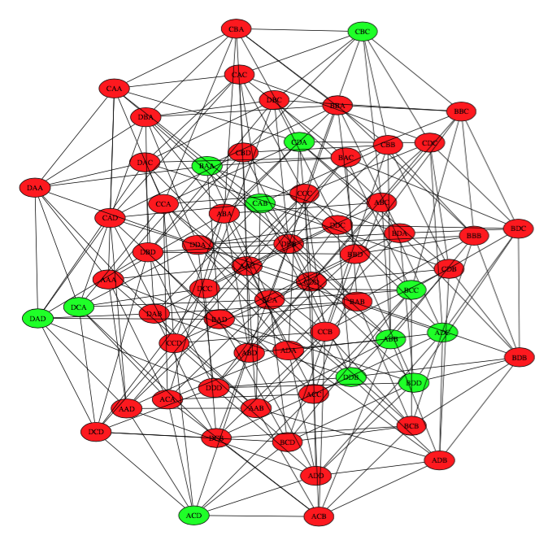
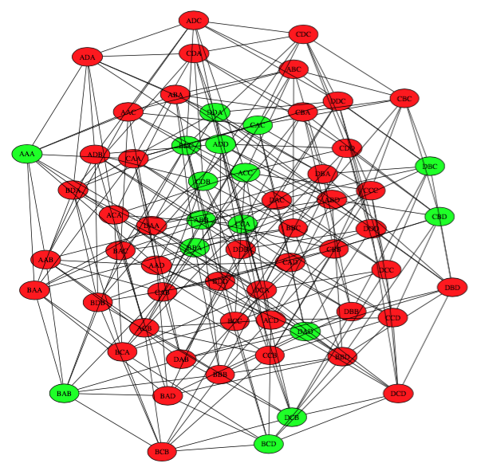

## Problem

Here's the problem statement found on:
* http://artofproblemsolving.com/community/c1590h1015789s3_problem_6_1990_usamo_1
* https://www.artofproblemsolving.com/wiki/index.php?title=1990_USAMO_Problems/Problem_1

```
Problem: A certain state issues license plates consisting of six digits (from 0 to 9). The state requires that any two license plates differ in at least two places. (For instance, the numbers 027592 and 020592 cannot both be used.) Determine, with proof, the maximum number of distinct license plates that the state can use.
```

## Analysis
How big can we make a pool of plates where every plate has 2, 3, 4, 5, or 6 differences? A natural tendency is to count all possible plates (10^6) and subtract the plates with 1 or 0 differences. We can ignore zero differences because any plate has no counterpart with 0 differences. But counting the plates with one difference between them is actually very difficult.

The problem is that there are different ways to decide which plates are the keepers, and which are the "copies" (the other plates differing at 1 position). For instance if I decide that 000000 is a keeper, then 000001, 000002, 000003, and so on become copies. But if I first decide that 000001 is a keeper, then 000000 must be thrown out.

If I choose two keepers, and they disclude mostly the same plates, it seems to be a more optimal choice than them discluding disjoint plates. Indeed, if my goal is to maximize the number of keepers, then my choice in selecting keepers makes a big difference in the outcome.

To demonstrate, let's suppose that instead of the 10 symbol digits in the problem description, we have only 4 symbols, call them A, B, C, D. And instead of a symbol length of 6, we have a reduced symbol length of 3. While the original problem counts 000001, 0000002, 000003 and so on, our smaller example will count AAA, AAB, AAC and so on. Our smaller example has 4^3=64 plates.

We will include plates DCA, CBC, ACD, CAB, ABB, BAA, ADC, BDD, DDB, DAD, BCC, CDA. With those 12 choices, we disclude the other 52 plates It seems an inefficient choice. To illustrate, here is an undirect graph where each vertex is connected to another when separated by only one position change. Green nodes are the ones included, and red ones are discluded. Obviously no green node can touch a red node.



The full details are of the choices are:
```
inclusion of DCA discludes DCB CCA DBA DCC DDA DCD ACA BCA DAA
inclusion of CBC discludes BBC CDC CBD CCC CBA CBB ABC CAC DBC
inclusion of ACD discludes ABD AAD ACB ACC BCD CCD ADD
inclusion of CAB discludes BAB DAB CCB CAA CAD CDB AAB
inclusion of ABB discludes ABA ADB DBB BBB 
inclusion of BAA discludes AAA BBA BAC BDA BAD
inclusion of ADC discludes ADA DDC BDC AAC 
inclusion of BDD discludes CDD DDD BDB BBD 
inclusion of DDB discludes 
inclusion of DAD discludes DBD DAC 
inclusion of BCC discludes BCB
inclusion of CDA discludes 
```

Now let's include the plates AAA, ABB, ACC, ADD, BAB, BBA, BCD, BDC, CAC, CBD, CCA, CDB, DAD, DBC, DCB, DDA. Here we have 16 plates included, discluding only 48:



Here's the transcript of these choices:
```
inclusion of AAA discludes AAB AAC AAD ABA ACA ADA BAA CAA DAA
inclusion of ABB discludes ABC ABD ACB ADB BBB CBB DBB
inclusion of ACC discludes ACD ADC BCC CCC DCC
inclusion of ADD discludes BDD CDD DDD
inclusion of BAB discludes BAC BAD BCB BDB CAB DAB
inclusion of BBA discludes BBC BBD BCA BDA CBA DBA
inclusion of BCD discludes CCD DCD
inclusion of BDC discludes CDC DDC
inclusion of CAC discludes CAD CBC DAC
inclusion of CBD discludes DBD
inclusion of CCA discludes CCB CDA DCA
inclusion of CDB discludes DDB
inclusion of DAD discludes 
inclusion of DBC discludes 
inclusion of DCB discludes 
inclusion of DDA discludes
```

Notice that on the second choice ABB, two plates that would have been eliminated were already gone due to the first choice AAA. Also, the last four choices didn't eliminate anything.

## Solutions

